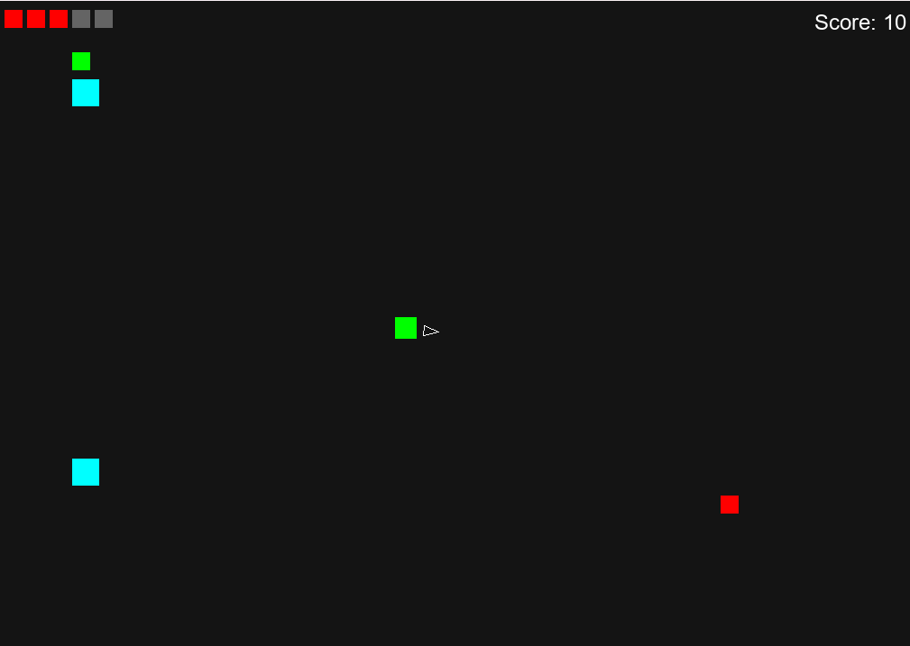
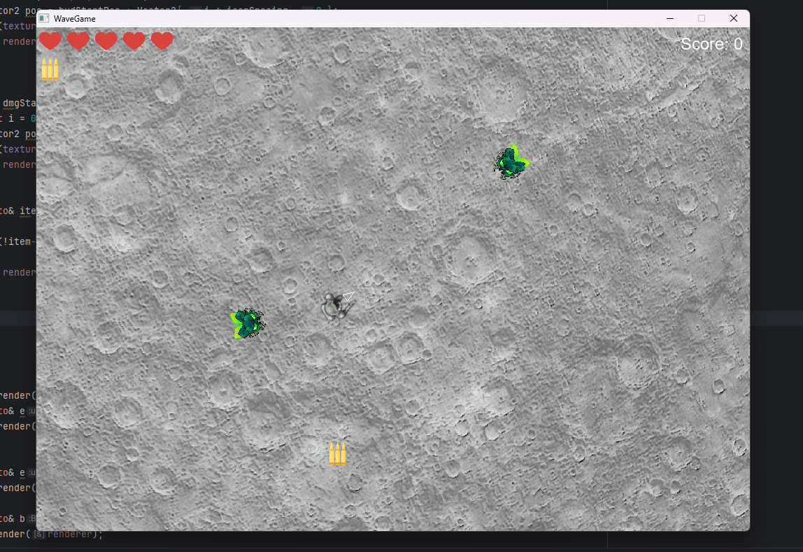

# AI-Assisted Game Development

University project to determen capabilities of AI assisted software development 

The goal of this project is to develop a game with the assistance of advanced language models and to evaluate their capabilities by documenting the development process and outcomes.

The game is an arcade-style title inspired by classic games from the 1980s and is developed in C++ using SDL2 and OpenGL with the assistance of ChatGPT-5.

The project is still work in progress and not finalized yet.

## Game Idea

The game is a top-down arcade-style survival shooter inspired by classic arcade titles of the 1980s. 
The player is positioned at the center of the arena and can move freely in all directions while shooting independently in a full 360° range.
Enemies continuously spawn from all sides of the playfield and swarm toward the player. 
Defeating enemies rewards points, with different enemy types granting different scores.
Some enemies may also drop power-ups that provide temporary advantages, such as healing, increased maximum health, enhanced weapons, or bonus points. 
The primary objective is to survive for as long as possible while achieving a high score.

## Implementation

### Initial Framework
The initial framework of the prototype was generated with the assistance of ChatGPT-5. 
The goal of this approach was to quickly create a functional starting point for further development. 
The prompt was based on the previously defined game concept, ensuring that the basic project requirements were considered.
The resulting framework represented a minimal implementation and included:
- A playable character
- A basic enemy type
- A simple scoring system
- A partially functional health system

The functionality was intentionally kept minimal, serving primarily as structural guidance. This early prototype proved to be extremely helpful for subsequent development.

### Example of the prototype

### Functional Extensions
The prototype was iteratively expanded and improved over time. Based on the initial framework, core features were first refined and stabilized, particularly the health and scoring systems. 
Additional gameplay mechanics were then added, including:
- Multiple enemy types
- A wave manager to control enemy spawning and gradually increase difficulty
- A simple state machine using switch statements to manage the title screen, game-over screen, and gameplay
- Temporary placeholder textures were also added to improve visual clarity and provide a foundation for integrating final assets.

Parallel to these additions, the code structure was refactored to improve readability and facilitate future expansions. 
This iterative approach allowed the prototype to be continuously enhanced both functionally and structurally.

### Example of Prototype after rework

## Benefits of AI-Assisted Development
Working with ChatGPT proved to be a very helpful support tool. 
It was particularly useful during project setup in C-Lion and for debugging errors, providing multiple helpful suggestions for troubleshooting. 
Overall, ChatGPT offers significant value in programming by accelerating problem-solving and providing guidance.
In addition to that ChatGPT has generated a clean an functioning basic prototype in a fraction of the time it would have taken me, however there a some issues and limitations.

## Challanges and Limittions
Some issues arise when using ChatGPT for longer, step-by-step implementation instructions in larger projects. 
The model can “forget” earlier details about the class structure and occasionally produces inconsistent variable and method names, which can lead to confusion and errors.

Additionally, while ChatGPT is highly useful, it requires careful review and a solid understanding of programming concepts. 
The tool works best when small, relevant code segments are shared, preventing the model from being overwhelmed and improving the quality of its suggestions.

## Future Features

Several features are planned to enhance gameplay, presentation, and overall player experience.

### Sound Engine

A dedicated audio system is planned to handle both background music and sound effects for player actions, enemies, and items.
The background music will dynamically adapt to the state of the game, with intensity changing according to gameplay events. 
This will highlight critical moments and increase player immersion.

### Wave Manager Enhancements

The existing wave management system will be improved to include dynamic difficulty adjustments based on player progress. 
A prestige system is also planned, which—upon reaching a certain enemy threshold—resets the number of enemies while introducing tougher enemy types. 
This feature aims to increase long-term engagement and replayability. Additional enemy types will be implemented to further enrich the system and progressively raise the challenge.

### Animated Sequences

Animated sequences are planned to enhance the visual appeal of the game. These animations will apply to characters, enemies, and items, providing visual feedback for gameplay events such as collecting items, hitting enemies, or reaching milestones. 
The animations will both improve aesthetics and serve as intuitive cues for player actions and achievements.

### Overall Graphics Rework

All assets used in the current prototype are sourced from free online game assets and combined to create a functional prototype. 
In future development, these assets will be replaced with custom artwork and animations. 
Additionally, selected elements will be enhanced with 3D graphics implemented using OpenGL to improve visual fidelity and overall presentation.

